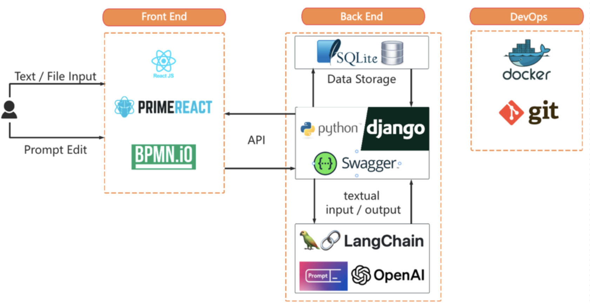
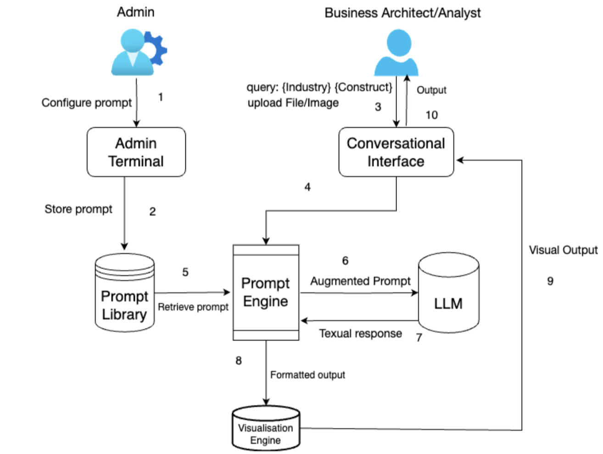

### Installation Manual

**1. Environment Configuration**

This project is Dockerized. Please follow these steps to configure and deploy the application:

**Environment Variable Configuration**:

1. **Create the `.env` File**:
   Create a `.env` file in the project root directory to hold your environment variables. You can use the `.env.example` file as a reference to configure your environment variables.

   ```text
   OPENAI_API_KEY=your_openai_api_key
   ```

   Replace `your_openai_api_key` with your actual OpenAI API key. **Note**: Ensure that the `.env` file is not committed to version control. You can add `.env` to your `.gitignore` file to prevent it from being committed.

   **Steps**:
   - Copy the `.env.example` file to create a `.env` file:
     ```bash
     cp .env.example .env
     ```
   - Edit the `.env` file to include your actual API key:
     ```text
     OPENAI_API_KEY=your_openai_api_key
     ```

**2. Local Deployment Steps**

1. **Install Docker**:
   First, ensure that Docker is installed on your machine. If not, download and install Docker from [Docker's official website](https://www.docker.com/products/docker-desktop).

2. **Navigate to the Project Directory**:
   Open a terminal and navigate to the project root directory:
   ```bash
   cd path/to/your/project
   ```

3. **Build and Start the Application**:
   Run the following command to build and start the Docker containers:
   ```bash
   docker-compose up --build
   ```

4. **Access the Application**:
   Once the application is running, you can access it via the following URLs:
   - **Chatbot Interface**: Open a web browser and go to [http://localhost:3000/chat](http://localhost:3000/chat)
   - **Admin Interface**: Open a web browser and go to [http://localhost:3000/admin](http://localhost:3000/admin)


### Architecture



### Workflow for Capability Map 
There are two roles in the system, Admin and Business Architect. As the system administrator, Admin is responsible for configuring the prompt and inputting and updating prompt through the admin terminal. Business Architect asks questions to the chatbot through the dialogue interface, queries the capability map of a specific industry, or uploads files/pictures to consult and request to draw a BPMN diagram. The system generates answers based on the prompts that are pre-configured by the Admin. And then the chatbot displays the results in a visual form according to the needs of the Business Architect. 


Flow of capability components: 

- Admin configures prompts through the management terminal 

- The backend server stores prompts in a SQLite database, called Prompt Library. 

- When Business Architect queries {industry}{capability map} through the dialogue interface or uploads files/pictures to consult questions. 

- The dialogue interface sends Business Architect's problem description and files to the system backend, also called Prompt Engine. 

- Prompt Engine retrieves relevant prompts configured by Admin from Prompt Library. 

- Prompt Engine processes the pictures/files uploaded by Business Architect, and combines the retrieved prompt information with the architect's query question to form an API request, which is then sent to the Large Language Model (LLM), i.e. OpenAI. 

- After receiving the request, LLM generates text content and transmits it to Prompt Engine. 

- Prompt Engine sends the received text content to Visualization Engine, which processes the content and converts it into a format that can be received by the front end. 

- The conversation interface displays the visual BPMN/Capability Map and text content to Business Architect. 
